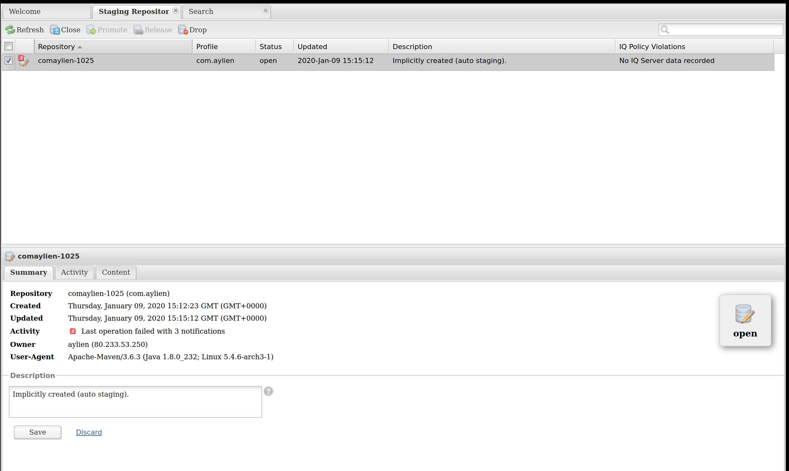

# Generation

We use OpenAPI Generator to automatically generate our SDKs. This process is mostly automated using a few scripts outlined here.

## Installing the generator

Use `install-openapi-generator.sh` to download the version of generator that we use.

```
sh ./install-openapi-generator.sh
```

## Generating the SDKs

The SDKs are generated from the API definition files found in the [`/aylien/v1/`](/aylien/v1) directory. There are also JSON configuration files in these directories for each language (see [`/aylien/v1/news/config`](/aylien/v1/news/config) for example). This process is automatic using the `generate-sdks.sh` script.

```
sh ./generate-sdks.sh
```

Please note that this script calls `install-openapi-generator.sh` if it can't find the `openapi-generator-cli.jar` file.

## Post-generation

Unfortunately the generator has some limitations, and these limitations make it necessary for us to do some post-processing of the SDKs in order to make them fit for daily use of our users. There is a script for automatically applying these changes:

```
sh ./post-generation-modification.sh
```

## Publishing

For publishing new versions of SDKs, first make sure you have bumped the version. Each SDK's version is controlled in [`aylien/v1/news/config/*.json`](../aylien/v1/news/config).

Credentials for publishing SDKs can be found in LastPass in a secure note called "SDK Credentials".

### Git

First step in publishing is pushing to git and creating a release. This step is the same for all SDKs and it is as follows:

```
cd sdks/news-api/javascript
rm -rf .git # to make sure there is no other git repo here
git init
git add .
git commit -m "Write release notes here"
git remote add origin git@github.com:aylien/aylien_newsapi_nodejs # substitute with correct repository name for each language

git pull origin master -s recursive -X theirs # this will ignore any rebase conflicts and take the local version to be the ground truth
git cherry-pick --skip # in case you find yourself in a cherry-picking state, sometimes happens
git rebase --continue # in case you find yourself in a rebasing state, sometimes happens
git push origin master
```

Don't forget to create a release on GitHub.

### JavaScript: npm

For publishing to npm, you need to set the correct credentials in `~/.npmrc`. You can find the line to put there in the secure note.

```
echo "//registry.npmjs.org/:_authToken=$NPM_AUTH_TOKEN" >$HOME/.npmrc
```

With that in place, build and publish:
```
npm install
npm run build
npm publish
```

Make sure to also push to the remote git repository and create a release.

### PHP: packagist

Packagist interacts directly with the Github repository, so for publishing you have to first push to [git](#git) and create a release, then trigger an update of the package either using curl or through the web interface. API Token can be found in the secure note.

```
curl -XPOST -H 'content-type:application/json' \
  "https://packagist.org/api/update-package?username=aylien&apiToken=$PACKAGIST_API_TOKEN" \
  -d '{"repository":{"url":"https://github.com/aylien/aylien_newsapi_php"}}'
```

Web interface: https://packagist.org/users/aylien/packages/

### Python: pypi

For uploading to pypi you need to install `twine`, build and check the package and then upload it. Username and password can be found in the secure note.

```
pip install twine
python setup.py sdist bdist_wheel
twine check dist/*
twine upload --non-interactive -u $PYPI_USERNAME -p $PYPI_PASSWORD dist/*
```

Make sure to also push to the remote git repository and create a release.

### Ruby: gems

Ruby Gems expects an API Key for uploading gems, this key can be found in the secure note. Put the key in place:

```
echo ":rubygems_api_key: $GEM_API_KEY" >$HOME/.gem/credentials
```

Then build and publish the gem:
```
gem build aylien_news_api.gemspec
gem push aylien_news_api-*.gem
```

Make sure to also push to the remote git repository and create a release.

### Go

Go directly retrieves the packages from Github, no publication necessary other than pushing to [git](#git) and making a release.

### Java: OSS Sonatype and Maven Central

Java is the beast. In order to publish to Maven Central there are a few steps necessary. First, you need to put the correct credentials in `~/.m2/settings.xml`. This file can be found in the secure note:

```
<settings>
  <servers>
    <server>
      <id>ossrh</id>
      <username>USERNAME</username>
      <password>PASSWORD</password>
    </server>
  </servers>
</settings>
```

Next you need to create a GPG key pair to sign the package before uploading it to OSS. It's recommended to generate an `@aylien` gpg key and use that for the purpose of signing the packages. To do that:

```
gpg --gen-key
```

Take note of your key ID, it's a long sequence similar to `6E8C607AAF0ADE4850C0A38AF8185E4E960E649B`.

Next you need to upload your public key to a keyserver:

```
gpg --send-keys 6E8C607AAF0ADE4850C0A38AF8185E4E960E649B
```

Once that's done, you can upload the package to OSS:

```
mvn clean deploy -P sign-artifacts
```

With that done, you should be able to find the uploaded package in "Staging Repositories" on OSS dashboard: https://oss.sonatype.org/#stagingRepositories

In the Summary tab at the bottom, you can see the status of the staging repository as "Open":



You can check the uploaded files in the "Content" tab and make sure everything looks good. Once you have verified the content, you can now "Close" the repository using buttons at the top of the screen. Closing will take around a minute, refresh to see if the closing went well. If closing fails and you get red notifications, you can check them in the "Activity" tab. Once you get the repository to close successfuly, you can now "Release" the repository for the package to be released into Maven Central.

> ℹ️ If you get "Failed: Signature Validation" with an error saying. "No public key: Key with id: (YOUR_KEY_ID_HERE) was not able to be located on <a href="http://pool.sks-keyservers.net:11371/">http://pool.sks-keyservers.net:11371/</a>. Upload your public key and try the operation again." that usually means you have recently uploaded your keys and you have to wait an hour or so before it is synchronized across servers.

### Automated Script

There is an automated script available for doing all of this, but you should only use it if you know what you are doing. Read the script before using it to understand how it works.

```
sh ./publish.sh 'Release Note here'
```

## Testing

See the `samples` directory for instructions on testing.
